# Exercise 2: Migrate a Spring Apps Microservices Application to Azure Container Apps

### Estimated Duration: 90 minutes

## Lab Scenario

In this exercise, you will set up a GitHub repository to manage configurations and use Azure CLI to prepare the cloud environment. You will create a private configuration repository, update the necessary files, and deploy the microservices of the Spring Petclinic application to Azure Container Apps (ACA). Additionally, you will create Java components for the configuration and discovery servers to ensure smooth service orchestration and management.It is now time to perform the actual migration of the Spring Petclinic application components.

## Lab Objectives

After you complete this lab, you will be able to:

  - Set Up GitHub Repository and Azure CLI Environment
  - Set up a configuration repository
  - Deploy the microservices of the Spring Petclinic app to ACA 
  - Create the java components for your config and discovery server

## Task 1: Set Up GitHub Repository and Azure CLI Environment

In this task, you will fork a parent repository to your GitHub account, set up the local development environment, and log into Azure CLI, installing required extensions.

1. Open the browser and navigate to [GitHub Login](https://www.google.com/url?sa=t&rct=j&q=&esrc=s&source=web&cd=&cad=rja&uact=8&ved=2ahUKEwiVub_3iuCIAxUQzjgGHUXtIJgQFnoECAkQAQ&url=https%3A%2F%2Fgithub.com%2Flogin&usg=AOvVaw0YPQjBCLvq4nLugtBaJju7&cshid=1727335715159967&opi=89978449) to login to your GitHub account.

1. On the GitHub Login page, provide your github credentials which you can find in the **Environment** page.

   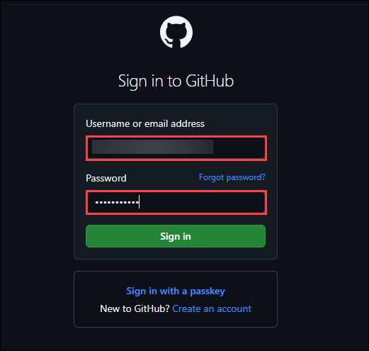

1. Once you successfully login to GitHub, open a new tab in your browser and navigate to [Parent Repo](https://github.com/CloudLabsAI-Azure/java-microservices-aca-lab/tree/main).

1. This repository containes source code for the **Petclinic** application, you will fork this repository and will be using it through out this lab.

1. In the repository page, use the **fork** option to fork this repository.

   

   >**&#128161;Tip:** A fork in GitHub is a copy of a repository that allows you to make changes independently without affecting the original project. It enables collaboration by letting you propose updates or modifications through pull requests.

1. On **Create a new fork** pane, leave everything as default and click on **Create fork**.

   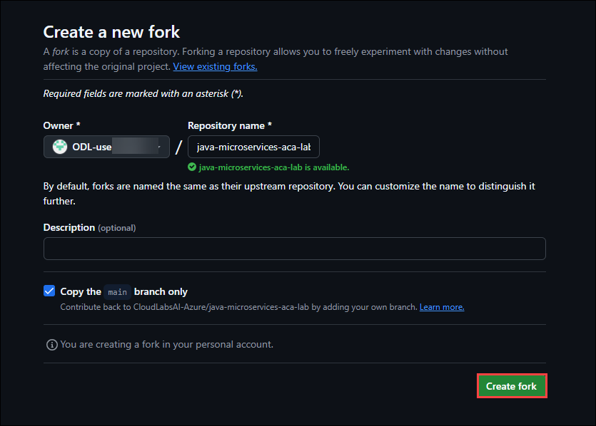

1. Now you have successfully forked the repository to your GitHub Account.

   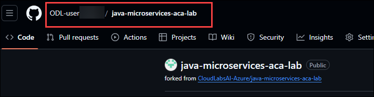

1. On the repository page, select **Code (1)** and copy the **git URL (2)** using the copy option.

   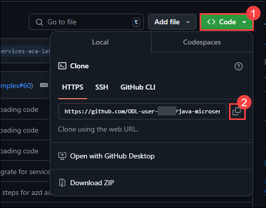

1. Once you copy the URL , open **Visual Studio Code** from the desktop.

   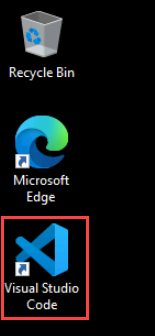

1. In **Visual Studio Code**, click on **new terminal** from the terminal menu.

   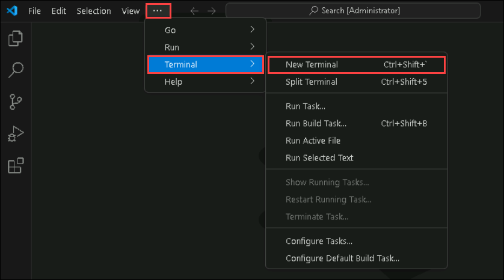

1. From the new terminal, switch to **Git Bash** by clicking on **+ (1)** and selecting **Git Bash (2)**.

   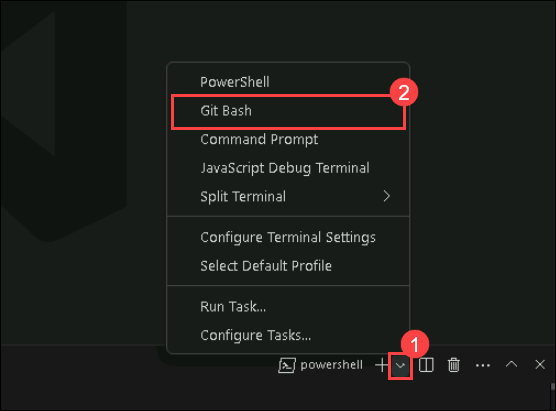

1. On **Git Bash** terminal, navigate to `C:\Labfiles` directory and clone the repository using the URL that you copied earlier.

   ```
   cd C:/Labfiles

   git clone <URL>
   ```
   >**&#128221;Note:** Make sure you replace the `<URL>` with the **Actual URL** that you have copied earlier.

   >**&#128161;Tip:** A clone in GitHub is a local copy of a repository that you download to your machine for development. It allows you to work on the project offline and push changes back to the original or a forked repository.

1. Once you cloned your repository, its time to setup **Azure CLI**. Run the following command to start the Azure login process.

   ```
   az login 
   ```

   >**&#128221;Note:** You may have to minimize the **VS Code** window to see the pop up window.

1. In the **Sign in** pop up window, select **Work or school account** and click on **Continue**.

   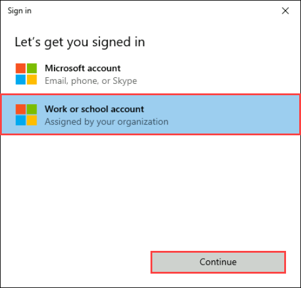

1. In the sign in page, provide the following:

   Username: <inject key="AzureAdUserEmail"></inject> and click on **Next**.

   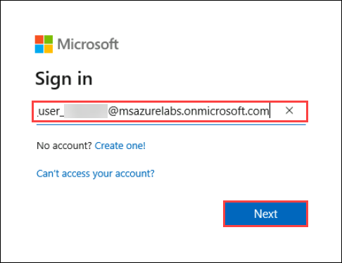

   Password: <inject key="AzureAdUserPassword"></inject> and click on **Sign in**.

   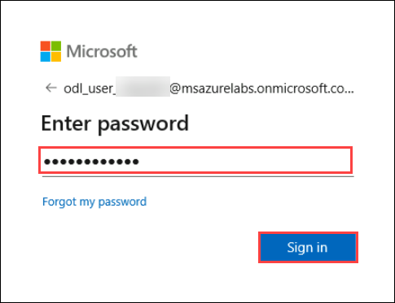

1. When prompts, click on **No, sign in to this app only** and continue.

1. Return to your **Visual Studio Code** terminal, now it prompts you to select subscription enter **131** and hit enter.

1. After successfully loging into your account, in terminal and run the following command to add the required extension.

   ```
   az extension add --name containerapp --upgrade
   ```

## Task 2: Set up a configuration repository

In this task, you will create a private GitHub repository to securely store configuration information, update the MySQL server endpoint with the latest details, and upload the necessary configuration files to the repository. Additionally ensure the security by genrating and using PAT Token.

1. Navigate back to your **GitHub** using browser.

1. Once you are in **GitHub** main page, select **Repositories** tab from the top menu.

   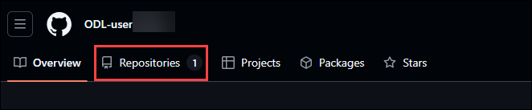

1. Once you are on the **Repositories** page, click on **New** to create a new repository.

   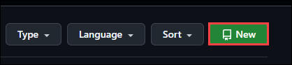

1. On **Create a new repository** pane, provide the following details:

   - **Repository name** : `java-microservices-aca-config` **(1)**.
   - Make sure to check **Private (2)** option to make this a private repository.
   - Check **Add a README file (3)** box.
   - Click on **Create repository**.

     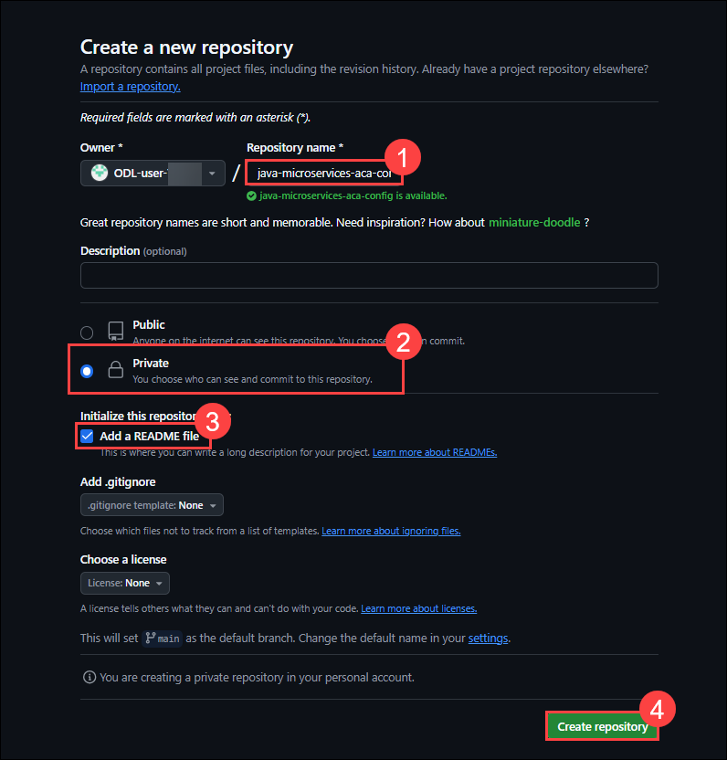

1. Once the repository is created, click on the profile picture from the **top right corner**.

1. On the profile menu, select **settings** option.

   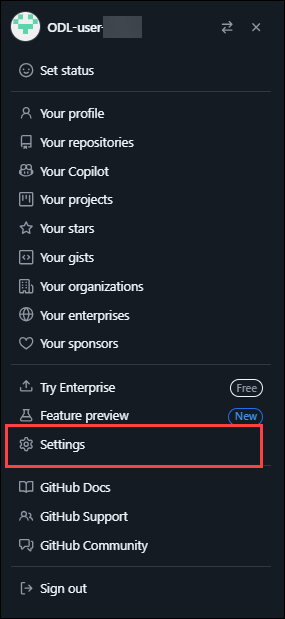

1. In the settings page, scroll down to end and select **Developer settings** from the left menu.

   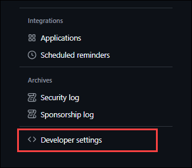

1. On the Developer settings pane, select **Tokens(Classic) (1)** and click on **Generate token (2)**. 

   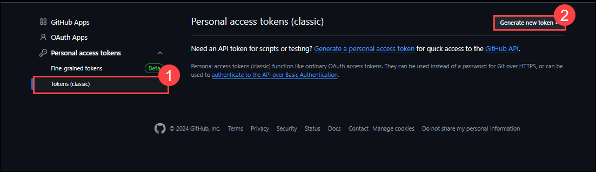

1. After clicking on **Generate token**, select **Generate new token (classic)**.

   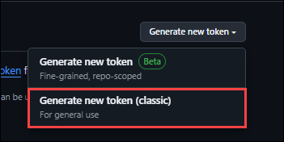

1. On the **New personal access token (classic)** page, provide **Note** as `java-microservices-pat-token` **(1)** and check the **repo (2)** option from the list. Scroll down to the end and click on **Generate token**.

   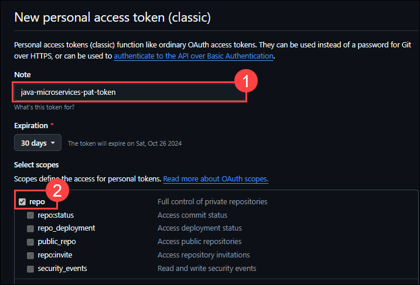

1. Once the token is successfully created, make a note of the token. 

   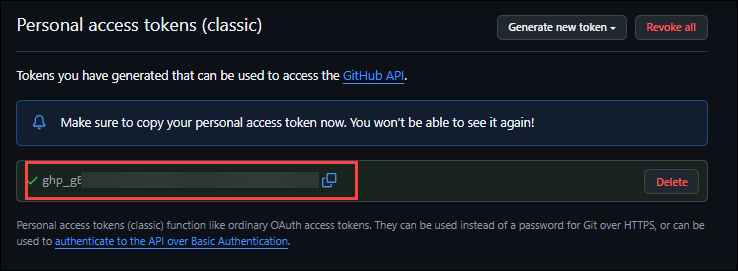

   >**&#128221;Note:** Make sure you note this token in a notepad. It will be used further in this lab.

1. From your repository page, copy the **Git URL** using the **<> Code** option.

   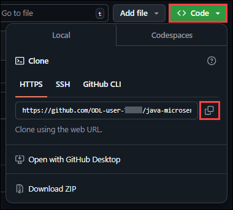

1. Once you have copied the **Git URL** of the configuration repository, navigate back to **Git bash** terminal in your **Visual Studio Code** and run the following command to clone the repository.

   ```
   cd C:/Labfiles

   git clone https://<token>@github.com/<username>/java-microservices-aca-config.git
   ```
   >**&#128221;Note:** Make sure to replace the `token` with the personal access token you copied earlier and `username` with your Github Username. the url will look similar to this.

   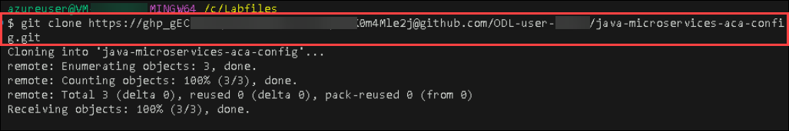

1. Once the repository is cloned, navigate to that cloned directory and download the configration files. This can be done by running the following command.

   ```
   cd java-microservices-aca-config

   curl -o application.yml https://raw.githubusercontent.com/Azure-Samples/java-microservices-aca-lab/main/config/application.yml
   curl -o api-gateway.yml https://raw.githubusercontent.com/Azure-Samples/java-microservices-aca-lab/main/config/api-gateway.yml
   curl -o customers-service.yml https://raw.githubusercontent.com/Azure-Samples/java-microservices-aca-lab/main/config/customers-service.yml
   curl -o discovery-server.yml https://raw.githubusercontent.com/Azure-Samples/java-microservices-aca-lab/main/config/discovery-server.yml
   curl -o tracing-server.yml https://raw.githubusercontent.com/Azure-Samples/java-microservices-aca-lab/main/config/tracing-server.yml
   curl -o vets-service.yml https://raw.githubusercontent.com/Azure-Samples/java-microservices-aca-lab/main/config/vets-service.yml
   curl -o visits-service.yml https://raw.githubusercontent.com/Azure-Samples/java-microservices-aca-lab/main/config/visits-service.yml
   curl -o chat-agent.yml https://raw.githubusercontent.com/Azure-Samples/java-microservices-aca-lab/main/config/chat-agent.yml
   ```
   >**&#128221;Note:** The output of this command will look similar to this.

   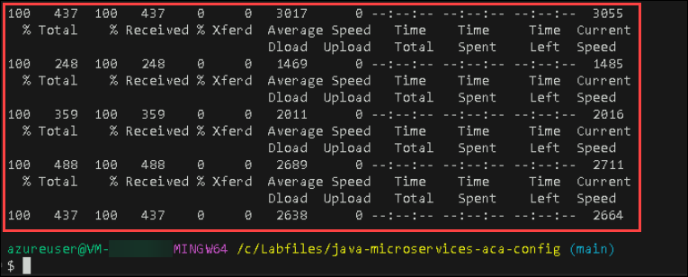

1. Once the files are download successfully, open the directory in **Visual Studio Code** editor by using the below command. This will **java-microservices-aca-config** directory  in a new window.

   ```
   code .
   ```

1. Once a new window of **Visual Studio Code** opened, select **application.yml** file from the explorer menu.

   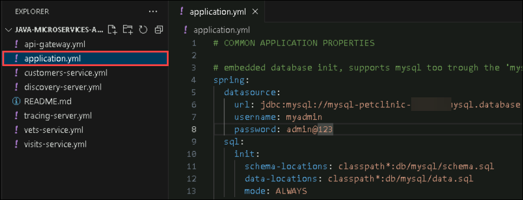

1. Once the **application.yml** file is open, replace the existing content with the following content.

   ```
    # COMMON APPLICATION PROPERTIES

    spring:
    datasource:
        url: jdbc:postgresql://<your-postgresql-server-name>.postgres.database.azure.com:5432/petclinic?sslmode=require
        username: myadmin
        password: admin@123
    sql:
        init:
        schema-locations: classpath*:db/mysql/schema.sql
        data-locations: classpath*:db/mysql/data.sql
        mode: always
    jms:
        queue:
        visits-requests: visits-requests
        visits-confirmations: visits-confirmations
        servicebus:
        enabled: false  # disable messaging support by default
        namespace: ${SERVICEBUS_NAMESPACE}
        pricing-tier: premium
        passwordless-enabled: true
        credential:
            managed-identity-enabled: true
            client-id: ${CLIENT_ID}
    sleuth:
        sampler:
        probability: 1.0
    cloud:
        config:
        # Allow the microservices to override the remote properties with their own System properties or config file
        allow-override: true
        # Override configuration with any local property source
        override-none: true
    jpa:
        open-in-view: false
        hibernate:
        ddl-auto: none
        show-sql: true

    # Spring Boot 1.5 makes actuator secure by default
    management.security.enabled: false
    # Enable all Actuators and not only the two available by default /health and /info starting Spring Boot 2.0
    management.endpoints.web.exposure.include: "*"

    # Temporary hack required by the Spring Boot 2 / Spring Cloud Finchley branch
    # Waiting issue https://github.com/spring-projects/spring-boot/issues/13042
    spring.cloud.refresh.refreshable: false

    # Logging
    logging:
    level:
        org.springframework: INFO
        org.hibernate.SQL: DEBUG
        org.springframework.jdbc.core: DEBUG
        org.springframework.orm.jpa: DEBUG

    # enable health probes
    management.health.livenessState.enabled: true
    management.health.readinessState.enabled: true
    management.endpoint.health.probes.enabled: true

    # Metrics
    management:
    endpoint:
        metrics:
        enabled: true
        prometheus:
        enabled: true
    endpoints:
        web:
        exposure:
            include: '*'
    metrics:
        export:
        prometheus:
            enabled: true
    eureka:
    client:
        serviceUrl:
        defaultZone: http://discovery-server:8761/eureka/
        enableSelfPreservation: true
        registryFetchIntervalSeconds: 20
    instance:
        preferIpAddress: true
   ```

1. Make sure you replace the `<your-postgresql-server-name>` with **postgres-petclinic-<inject key="DeploymentID" enableCopy="false" />**.

   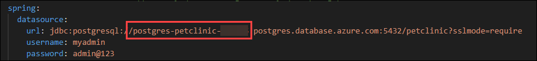

1. Once the changes are done, make sure to save the file by using the **Save** option from file menu.

   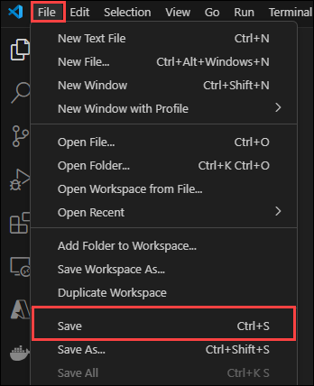

1. Now you can close the new window, navigate back to your **Git Bash** terminal and run the below commands to set the **GitHub** identity.

   ```
   git config --global user.email "<GitHub UserEmail>"

   git config --global user.name "<GitHub UserName>"
   ```

   >**&#128221;Note:** Make sure to replace the `<GitHub UserEmail>` and `<GitHub UserName>` with your actual GitHub Credentials.
    
   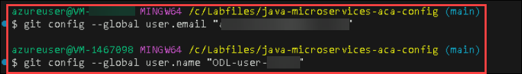

1. Once the identity is set, use the below commands to push the changes to your remote repository.

   ```
   git add .

   git commit -m "commiting changes"

   git push
   ```

   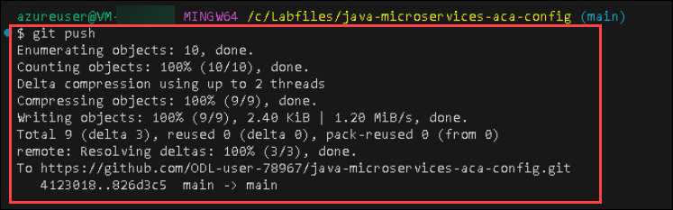

## Task 3: Deploy the microservices of the Spring Petclinic app to Azure Container Apps

In this task, you will build your application using maven, and will be using the Azure Cli commands to deploy all the container apps for your microservices.

1. Navigate back to **Visual Studio Code**, and from the file menu, select **Open Folder** to open a folder in your **Visual Studio Code** window.

   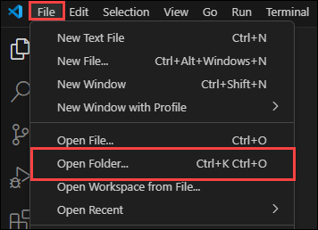

1. In the browse window, navigate to `C:\Labfiles\java-microservices-aca-lab\src` folder and click on **Select Folder**. This will open your **Source Code** directory in **Visual Studio Code** window.

1. Verify once all the files are present in the directory.

   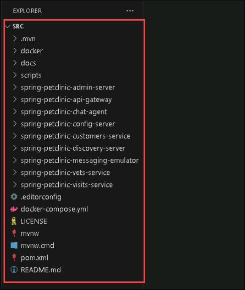

1. In the **Visual Studio Code** window, open **new terminal** from the terminal menu.

   

1. From the new terminal, switch to **Git Bash** by clicking on **+ (1)** and selecting **Git Bash (2)**. Make sure you are in the `src` directory.

   

1. Now in the terminal, run the following command to clean the packages and build using maven.

   ```
   mvn clean package -DskipTests
   ```

1. Please wait till the builds are successfull. Proceed further ,once you see the **BUILD SUCCESSFULL** message on the terminal.

   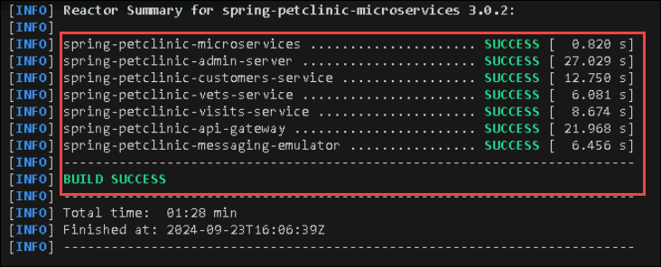

1. You have to set some environment variables, which helps in the deployment of container apps. run the command to set variables.

   ```
   RESOURCE_GROUP=petclinic-<inject key="DeploymentID" enableCopy="false" />
   ACA_ENVIRONMENT=acaenv-petclinic-<inject key="DeploymentID" enableCopy="false" />
   MYSQL_SERVER_NAME=mysql-<inject key="DeploymentID" enableCopy="false" />
   VERSION=$(mvn -q -Dexec.executable=echo -Dexec.args='${project.version}' --non-recursive exec:exec)
   echo $VERSION
   ```

1. Now you can create each of the microservices. You’ll start with the api-gateway. Run the below command to deploy container app for **api-gateway** service of your application.

   ```
   APP_NAME=api-gateway

   az containerapp create \
      --name $APP_NAME \
      --resource-group $RESOURCE_GROUP \
      --ingress external \
      --target-port 8080 \
      --environment $ACA_ENVIRONMENT \
      --min-replicas 1 \
      --artifact ./spring-petclinic-api-gateway/target/spring-petclinic-api-gateway-$VERSION.jar \
      --runtime java
   ```

   >**&#128221;Note:** If the build fails, please run the command again this will resolve the error.

1. Now you have successfully deployed conatiner app for `api-gateway` service. Now you can deploy other microservices by running the following command blocks one by one.

   * admin-server

   ```
   APP_NAME=admin-server
   az containerapp create \
      --name $APP_NAME \
      --resource-group $RESOURCE_GROUP \
      --ingress external \
      --target-port 8080 \
      --environment $ACA_ENVIRONMENT \
      --min-replicas 1 \
      --artifact ./spring-petclinic-admin-server/target/spring-petclinic-admin-server-$VERSION.jar \
      --runtime java
   ```

   * customers-service

   ```
   APP_NAME=customers-service
   az containerapp create \
      --name $APP_NAME \
      --resource-group $RESOURCE_GROUP \
      --ingress internal \
      --target-port 8080 \
      --environment $ACA_ENVIRONMENT \
      --min-replicas 1 
      --artifact ./spring-petclinic-customers-service/target/spring-petclinic-customers-service-$VERSION.jar \
      --runtime java
   ```

   * vets-service

   ```
   APP_NAME=vets-service
   az containerapp create \
      --name $APP_NAME \
      --resource-group $RESOURCE_GROUP \
      --ingress internal \
      --target-port 8080 \
      --environment $ACA_ENVIRONMENT \
      --min-replicas 1 \
      --artifact ./spring-petclinic-vets-service/target/spring-petclinic-vets-service-$VERSION.jar \
      --runtime java
   ```

   * visits-service

   ```
   APP_NAME=visits-service
   az containerapp create \
      --name $APP_NAME \
      --resource-group $RESOURCE_GROUP \
      --ingress internal \
      --target-port 8080 \
      --environment $ACA_ENVIRONMENT \
      --min-replicas 1 \
      --artifact ./spring-petclinic-visits-service/target/spring-petclinic-visits-service-$VERSION.jar \
      --runtime java
   ```

## Task 4: Create the java components for your config and discovery server

In this task, you will create configuration server which uses the configuration repository created earlier, a eureka server for service discovery with the help of Java components in container environment and Test the application.

1. To setup java components like config server and eureka server, In the Azure Portal, select **resource group** from navigate menu.

   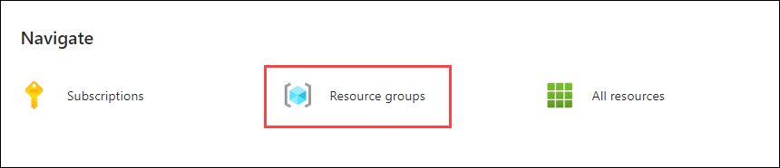

1. From the resource group list, select the resource group **petclinic-<inject key="DeploymentID" enableCopy="false" />**.

   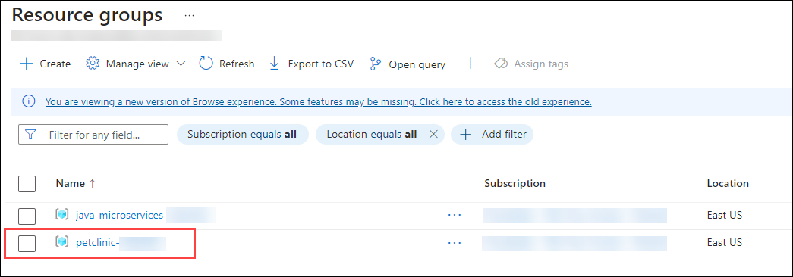


1. In the resource list, select **acaenv-petclinic-<inject key="DeploymentID" enableCopy="false" />** from the Azure Portal.

   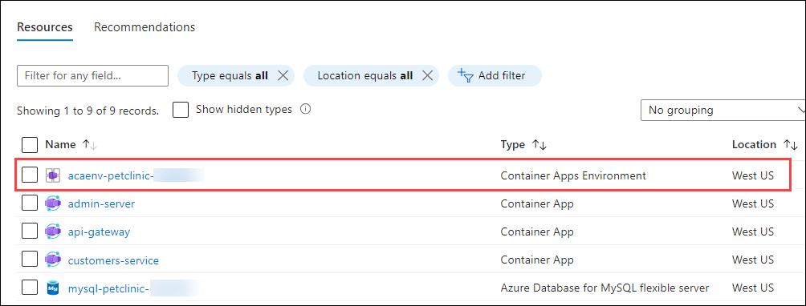

1. In the Container app environment's overview page, select **Services (1)** from the left menu, click on **+ Configure (2)** and select **Java component (3)**.

   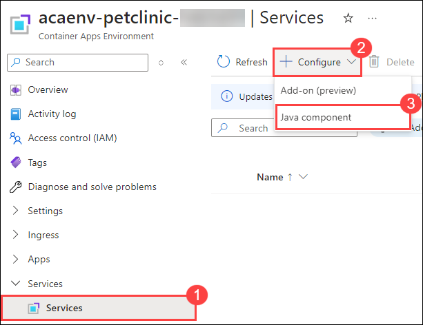

1. On **Configure Java component** page, select **Java component type** as **Config Server for Spring (1)**, **Java component name** as **myconfigserver** and click on **+ Add (3)** to add your config repository details. 

   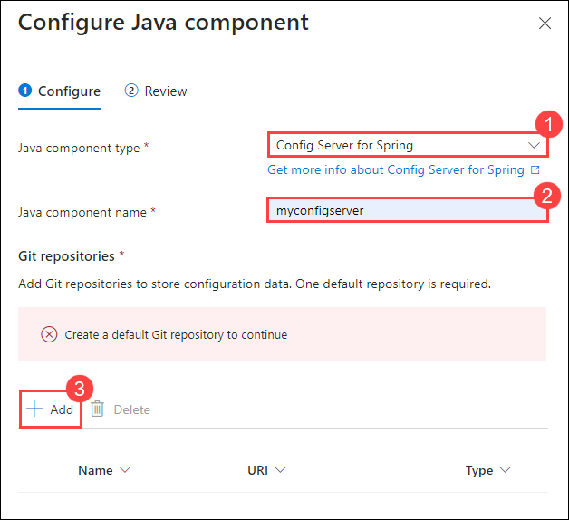

1. In **Add Git repository** page, provide details as follows:

   - **Type** : Leave as `Default` **(1)**.
   - **URI** : Provide your **Config reposirtoy URI (2)** that you have copied earlier.
   - **Branch name** : `main` **(3)**.
   - **Authentication** : Select `HTTP Basic` **(4)** from the dropdown.
   - **Username** : Provide your **GitHub Username (5)**.
   - **Password** : Use the **PAT Token (6)**, that you have copied earlier.
   - Click on **Add (7)**.

     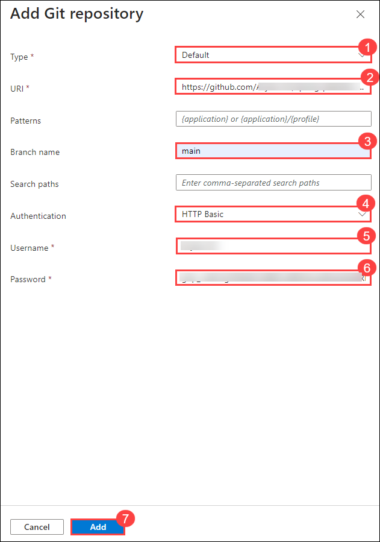

1. Once the repository details added, select all your container apps from the dropdown under **Bindings**. Verify once all the **container apps selected (1)**, click on **Next (2)**. 

   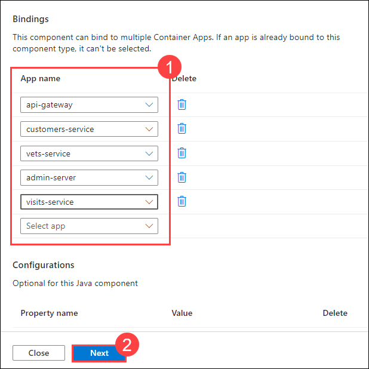

1. Review the configurations and click on **Configure**.

   >**&#128161;Tip:** **Config Server** - refers to a Spring Cloud Config Server deployed on Azure, which provides centralized external configuration for distributed systems, particularly Java-based microservices.

1. Once the configuration is successfull, go back to the **Services** pane from the left menu, click on **+ Configure** and select **Java component**.

   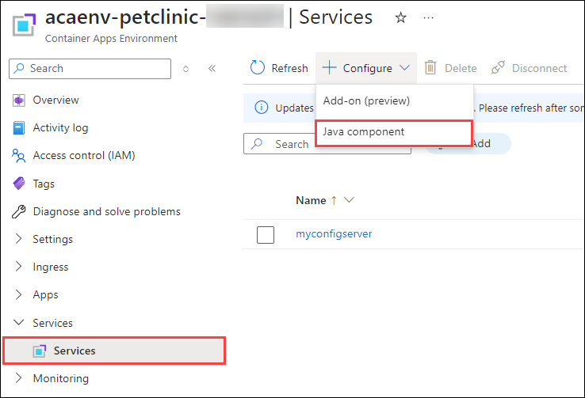

1. On **Configure Java component** page, provide the following details:

   - **Java component type** : Select `Eureka Server for Spring` **(1)** from dropdown.
   - **Java component name** : `eureka` **(2)**.
   - **Bindings** : Make sure all **Container Apps (3)** are selected.
   - **Property name** : `eureka.server.response-cache-update-interval-ms` **(4)**.
   - **Value** : `10000` **(5)**.
   - Click on **Next (6)**.

     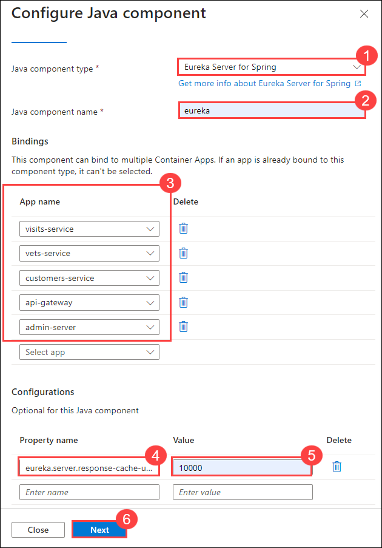

1. Review the configurations and click on **Configure**.

   >**&#128161;Tip:** **Eureka Server** - is a core component of Spring Cloud Netflix used for service discovery in microservice architectures. It allows microservices to register themselves and discover other services, enabling dynamic scaling and routing in distributed systems.

1. Once the configurations are done, navigate to the resource list and select **api-gateway** Container App from the list.

   

1. Copy the **Application URL**, paste it in a new browser tab.

   

1. Now you will see your **Petclinic** application is successfully running on container apps.

   

1. Navigate to **owners** tab and select **All**, you can see the user details which are rendered from the database.

   

   >**&#128221;Note:** Refresh the page, if you are not able to see user data.

## Summary

In this exercise, you have set up a GitHub repository to manage configurations and used Azure CLI to prepare the cloud environment. You created a private configuration repository, updated the necessary files, and deployed the microservices of the Spring Petclinic application to Azure Container Apps (ACA). Additionally, you created Java components for the configuration and discovery servers to ensure smooth service orchestration and management and also tested the application.

### You have Successfully completed the Lab!
