# Exercise 1: Migrate a Spring Apps Microservices Application to Azure Container Apps

### Estimated Duration: 120 minutes

## Lab Scenario

In this exercise, you will set up a GitHub repository to manage configurations and use Azure CLI to prepare the cloud environment. You will create a private configuration repository, update the necessary files, and deploy the microservices of the Spring Petclinic application to Azure Container Apps (ACA). Additionally, you will create Java components for the configuration and discovery servers to ensure smooth service orchestration and management.It is now time to perform the actual migration of the Spring Petclinic application components.

## Lab Objectives

After you complete this lab, you will be able to:

  - Set Up GitHub Repository and Azure CLI Environment
  - Set up a configuration repository
  - Deploy the microservices of the Spring Petclinic app to ACA 
  - Create the java components for your config and discovery server

## Task 1: Set Up GitHub Repository and Azure CLI Environment

In this task, you will fork a parent repository to your GitHub account, set up the local development environment, and log into Azure CLI, installing required extensions.

1. On your LABVM, open **Visual Studio Code** from the desktop.

   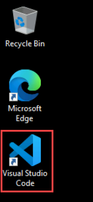

1. In **Visual Studio Code**, click on **new terminal** from the terminal menu.

   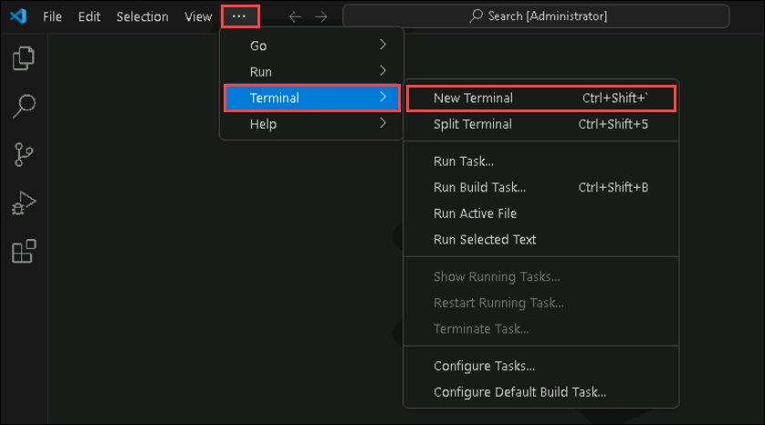

1. From the new terminal, switch to **Git Bash** by clicking on **+ (1)** and selecting **Git Bash (2)**.

   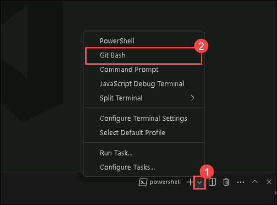

1. Once you are in the Git bash terminal, run the following command to start the Azure login process.

   ```
   az login 
   ```

   >**Note:** You may have to minimize the **VS Code** window to see the pop up window.

1. In the **Sign in** pop up window, select **Work or school account** and click on **Continue**.

   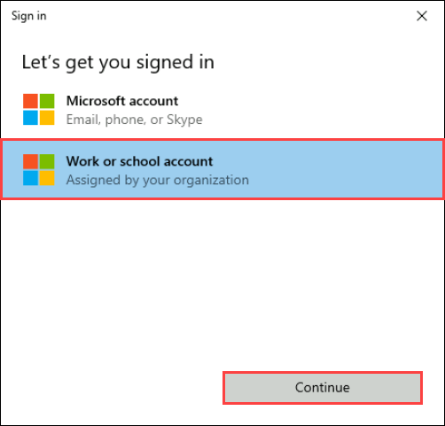

1. In the sign in page, provide the following:

   Username:  and click on **Next**.

   

   Password: and click on **Sign in**.

   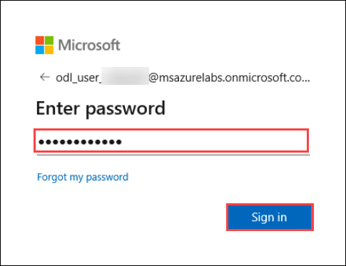

1. When prompts, click on **No, sign in to this app only** and continue.

1. Return to your **Visual Studio Code** terminal, now it prompts you to select subscription enter 131 and hit enter.

1. After successfully loging into your account, in terminal and run the following command to add the required extension.

   ```
   az extension add --name containerapp --upgrade
   ```

## Task 2: Set up a configuration repository

In this task, you will create a private GitHub repository to securely store configuration information, update the MySQL server endpoint with the latest details, and upload the necessary configuration files to the repository. Additionally ensure the security by genrating and using PAT Token.

1. Open the browser, Navigate to [GitHub Login](https://github.com/login). Use the credentials from the **environment** and login to your account.

1. Once logged in to **GitHub**, Navigate to the **Repositories** page and click on **New**, to create a new repository.

1. Once the repository is created, copy the **Clone URL**.

(pending)

## Task 3: Deploy the microservices of the Spring Petclinic app to Azure Container Apps

In this task, you will build your application using maven, and will be using the Azure Cli commands to deploy all the container apps for your microservices.

1. Navigate back to  **Visual studio code** git bash terminal, which you were using previously. If closed, can open a new **Git Bash** terminal.

1. Now from the terminal, navigate to `C:\Labfiles\aca\java-microservices-aca-lab-main\src` directory by running the below command.

   ```
   cd C:/Labfiles/aca/java-microservices-aca-lab-main/src
   ```
1. Now in the terminal, run the following command to clean the packages and build using maven.

   ```
   mvn clean package -DskipTests
   ```

1. Please wait till the builds are successfull. Proceed further ,once you see the **BUILD SUCCESSFULL** message on the terminal.

   

1. You have to set some environment variables, which helps in the deployment of container apps. run the command to set variables.

   ```
   RESOURCE_GROUP=petclinic-<inject key="DeploymentID" enableCopy="false" />
   ACA_ENVIRONMENT=acaenv-petclinic-<inject key="DeploymentID" enableCopy="false" />
   ```

1. Now you can create each of the microservices. You’ll start with the api-gateway. Run the below command to deploy container app for **api-gateway** service of your application.

   ```
   APP_NAME=api-gateway

   az containerapp create \
      --name $APP_NAME \
      --resource-group $RESOURCE_GROUP \
      --ingress external \
      --target-port 8080 \
      --environment $ACA_ENVIRONMENT \
      --min-replicas 1 
   ```
   >**Note**: It may take few minutes to deploy the container app.

1. Now you have successfully deployed conatiner app for `api-gateway` service. Now you can deploy other microservices by running the following command blocks one by one.

   * admin-server

   ```
   APP_NAME=admin-server
   az containerapp create \
      --name $APP_NAME \
      --resource-group $RESOURCE_GROUP \
      --ingress external \
      --target-port 8080 \
      --environment $ACA_ENVIRONMENT \
      --min-replicas 1
   ```

   * customers-service

   ```
   APP_NAME=customers-service
   az containerapp create \
      --name $APP_NAME \
      --resource-group $RESOURCE_GROUP \
      --ingress internal \
      --target-port 8080 \
      --environment $ACA_ENVIRONMENT \
      --min-replicas 1 
   ```

   * vets-service

   ```
   APP_NAME=vets-service
   az containerapp create \
      --name $APP_NAME \
      --resource-group $RESOURCE_GROUP \
      --ingress internal \
      --target-port 8080 \
      --environment $ACA_ENVIRONMENT \
      --min-replicas 1
   ```

   * visits-service

   ```
   APP_NAME=visits-service
   az containerapp create \
      --name $APP_NAME \
      --resource-group $RESOURCE_GROUP \
      --ingress internal \
      --target-port 8080 \
      --environment $ACA_ENVIRONMENT \
      --min-replicas 1
   ```

## Task 4: Create the java components for your config and discovery server

In this task, you will create configuration server which uses the configuration repository created earlier, a eureka server for service discovery with the help of Java components in container environment and Test the application.

1. To setup java components like config server and eureka server, In the Azure Portal, select **resource group** from navigate menu.

   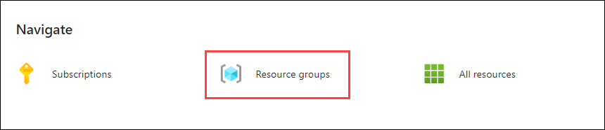

1. From the resource group list, select the resource group **petclinic-<inject key="DeploymentID" enableCopy="false" />**.

   


1. In the resource list, select **acaenv-petclinic-<inject key="DeploymentID" enableCopy="false" />** from the Azure Portal.

   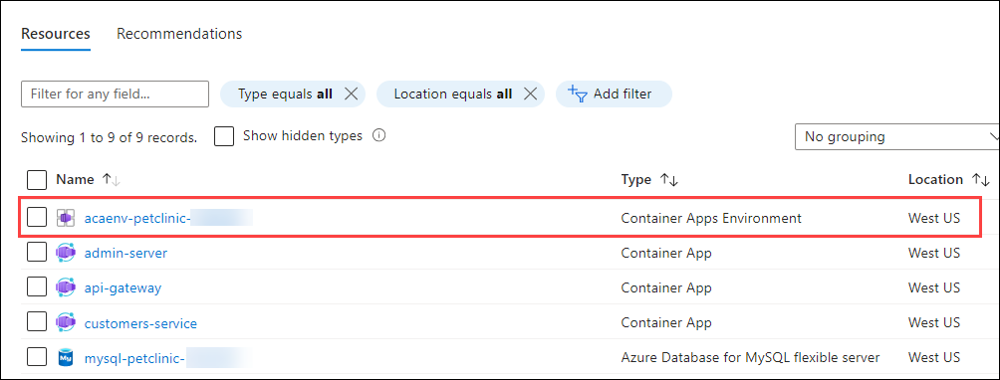

1. In the Container app environment's overview page, select **Services (1)** from the left menu, click on **+ Configure (2)** and select **Java component (3)**.

   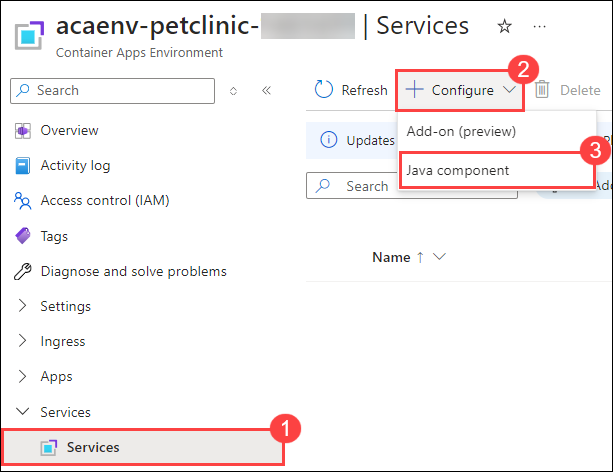

1. On **Configure Java component** page, select **Java component type** as **Config Server for Spring (1)**, **Java component name** as **myconfigserver** and click on **+ Add (3)** to add your config repository details. 

   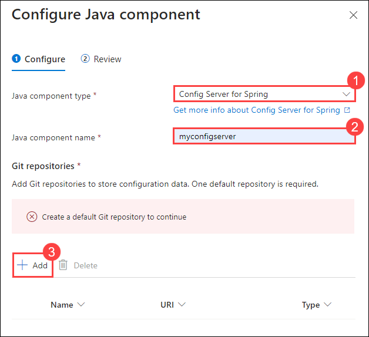

1. In **Add Git repository** page, provide details as follows:

   - **Type** : Leave as `Default` **(1)**.
   - **URI** : Provide your **Config reposirtoy URI (2)** that you have copied earlier.
   - **Branch name** : `main` **(3)**.
   - **Authentication** : Select `HTTP Basic` **(4)** from the dropdown.
   - **Username** : Provide your **GitHub Username (5)**.
   - **Password** : Use the **PAT Token (6)**, that you have copied earlier.
   - Click on **Add (7)**.

     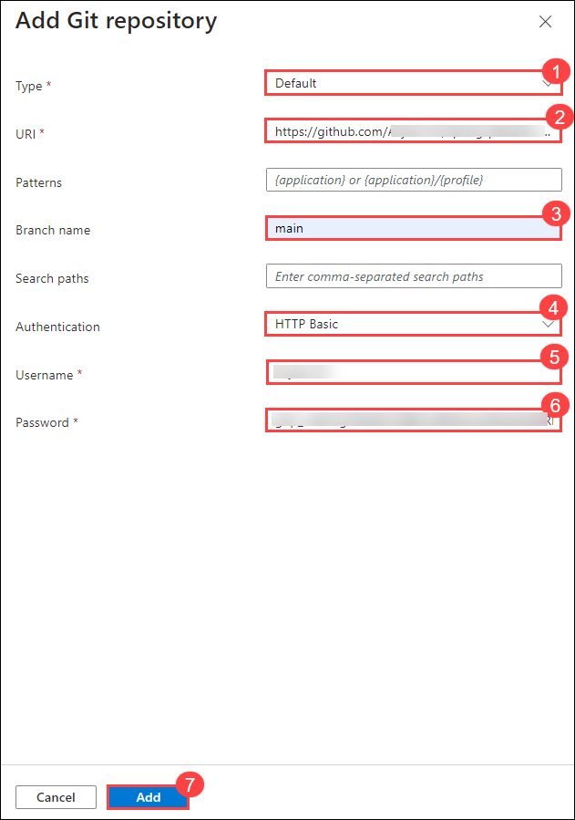

1. Once the repository details added, select all your container apps from the dropdown under **Bindings**. Verify once all the **container apps selected (1)**, click on **Next (2)**. 

   

1. Review the configurations and click on **Configure**.

1. Once the configuration is successfull, go back to the **Services** pane from the left menu, click on **+ Configure** and select **Java component**.

   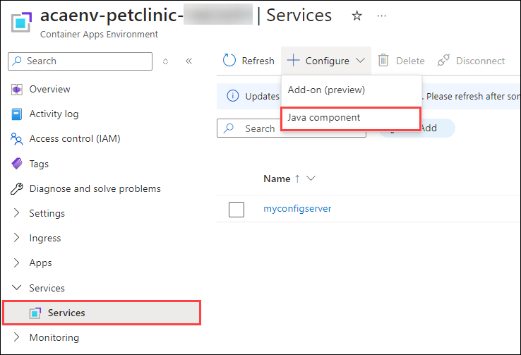

1. On **Configure Java component** page, provide the following details:

   - **Java component type** : Select `Eureka Server for Spring` **(1)** from dropdown.
   - **Java component name** : `eureka` **(2)**.
   - **Bindings** : Make sure all **Container Apps (3)** are selected.
   - **Property name** : `eureka.server.response-cache-update-interval-ms` **(4)**.
   - **Value** : `10000` **(5)**.
   - Click on **Next (6)**.

     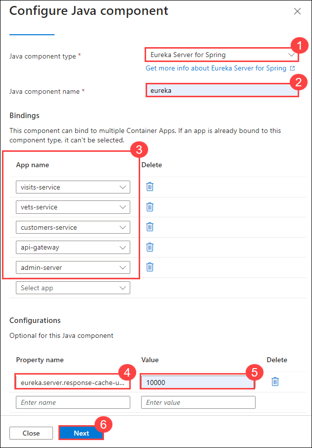

1. Review the configurations and click on **Configure**.

1. Now you need to upload artifacts to the container apps that you have created previously to complete the deployment process. From the resource list, select **admin-server** container app.

   

1. On the **admin-server** pane, select the **Get started (1)** tab from top and click on **Upload (2)**.

   

   >**Note:** You may see an error under **Revisions with issues**, you can igonre this for now. This will be resolved once the artifact is uploaded.

1. On the **Upload artifact** pane, click on **Browse** to select the artifact file.

   

1. On the browse tab, navigate to `C:\Labfiles\aca\java-microservices-aca-lab-main\src\spring-petclinic-admin-server\target` and select the `spring-petclinic-admin-server-3.0.2.jar` file.

1. Once the file is selected, click on **Apply**.

   

   >**Note:** This process may take few minutes complete.

1. Once after the artifact successfully uloaded, Select **Revision and replicas** from left menu and check the status of replica, which will be in **Activating and Deprovisioning state** state.

   

1. Wait untill the status changes to **Running**.

   

   >**Note:** It may take few minutes to change into running state, its better to wait untill the status is changed and move to next container app.

1. Now that you have uploaded artifact for one service, you have to repeat the steps to upload artifacts for all the services. The artifact file will be diffrent for all service.

   | Container App  |       File Path      |
   | ---------------|----------------------|
   | api-gateway    | C:\Labfiles\aca\java-microservices-aca-lab-main\src\spring-petclinic-api-gateway\target\spring-petclinic-api-gateway-3.0.2.jar |
   | customers-service | C:\Labfiles\aca\java-microservices-aca-lab-main\src\spring-petclinic-customers-service\target\spring-petclinic-customers-service-3.0.2.jar |
   | vets-service | C:\Labfiles\aca\java-microservices-aca-lab-main\src\spring-petclinic-vets-service\target\spring-petclinic-vets-service-3.0.2.jar |
   | visits-service | C:\Labfiles\aca\java-microservices-aca-lab-main\src\spring-petclinic-visits-service\target\spring-petclinic-visits-service-3.0.2.jar |

   >**Note:** Please ensure that replicas of all the Container Apps are in running state before moving further.

1. Once the configurations are done, navigate to the resource list and select **api-gateway** Container App from the list.

   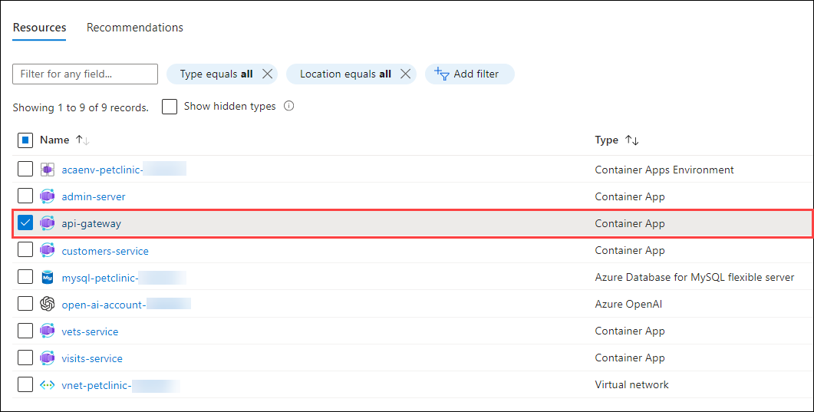

1. Copy the **Application URL**, paste it in a new browser tab.

   

1. Now you will see your **Petclinic** application is successfully running on container apps.

   

1. Navigate to **owners** tab and select **All**, you can see the user details which are rendered from the database.

   

   >**Note:** Refresh the page, if you are not able to see user data.

## Summary

In this exercise, you have set up a GitHub repository to manage configurations and used Azure CLI to prepare the cloud environment. You created a private configuration repository, updated the necessary files, and deployed the microservices of the Spring Petclinic application to Azure Container Apps (ACA). Additionally, you created Java components for the configuration and discovery servers to ensure smooth service orchestration and management and also tested the application.

### You have Successfully completed the Lab!