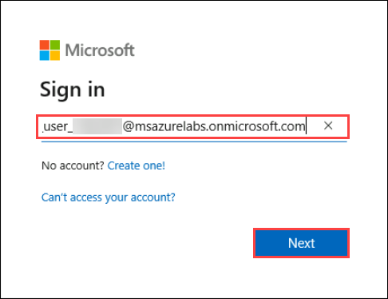
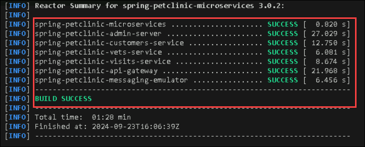

## Exercise 1: Migrate a Spring Apps microservices application to Azure Container Apps

### Task 1: Setup Azure CLI

1. On your LABVM, open **Visual Studio Code** from the desktop.

   

1. In **Visual Studio Code**, click on **new terminal** from the terminal menu.

   

1. From the new terminal, switch to **Git Bash** by clicking on **+ (1)** and selecting **Git Bash (2)**.

   

1. Once you are in the Git bash terminal, run the following command to start the Azure login process.

   ```
   az login 
   ```

1. In the **Sign in** pop up window, select **Work or school account** and click on **Continue**.

   

1. In the sign in page, provide the following:

   Username:  and click on **Next**.

   

   Password: and click on **Sign in**.

   

1. When prompts, click on **No, sign in to this app only** and continue.

1. After successfully loging into your account, navigate back to Visual studio code terminal and run the following command to add the required extension.

   ```
   az extension add --name containerapp --upgrade
   ```
### Task 2: Set up a configuration repository

1. Open the browser, Navigate to [GitHub Login](https://github.com/login). Use the credentials from the **environment** and login to your account.

1. Once logged in to **GitHub**, Navigate to the **Repositories** page and click on **New**, to create a new repository.

1. Once the repository is created, copy the **Clone URL**.

(pending)

### Task 3: Deploy the microservices of the Spring Petclinic app to Azure Container Apps

1. Navigate back to  **Visual studio code** git bash terminal, which you were using previously. If closed, can open a new **Git Bash** terminal.

1. Now from the terminal, navigate to `C:\Labfiles\aca\java-microservices-aca-lab-main\src` directory by running the below command.

   ```
   cd C:/Labfiles/aca/java-microservices-aca-lab-main/src
   ```
1. Now in the terminal, run the following command to clean the packages and build using maven.

   ```
   mvn clean package -DskipTests
   ```

1. Please wait till the builds are successfull. Proceed further ,once you see the **BUILD SUCCESSFULL** message on the terminal.

   

1. You have to set some environment variables, which helps in the deployment of container apps. run the command to set variables.

   ```
   RESOURCE_GROUP=petclinic-<inject key="DeploymentID" enableCopy="false" />
   ACA_ENVIRONMENT=acaenv-<inject key="DeploymentID" enableCopy="false" />

   ```

1. Now you can create each of the microservices. You’ll start with the api-gateway. Run the below command to deploy container app for **api-gateway** service of your application.

   ```
   APP_NAME=api-gateway

   az containerapp create \
      --name $APP_NAME \
      --resource-group $RESOURCE_GROUP \
      --ingress external \
      --target-port 8080 \
      --environment $ACA_ENVIRONMENT \
      --min-replicas 1 
   ```
   >**Note**: It may take few minutes to deploy the container app.

1. Now you have successfully deployed conatiner app for `api-gateway` service. Now you can deploy other microservices by running the following command blocks one by one.

   * admin-server

   ```
   APP_NAME=admin-server
   az containerapp create \
      --name $APP_NAME \
      --resource-group $RESOURCE_GROUP \
      --ingress external \
      --target-port 8080 \
      --environment $ACA_ENVIRONMENT \
      --min-replicas 1
   ```

   * customers-service

   ```
   APP_NAME=customers-service
   az containerapp create \
      --name $APP_NAME \
      --resource-group $RESOURCE_GROUP \
      --ingress internal \
      --target-port 8080 \
      --environment $ACA_ENVIRONMENT \
      --min-replicas 1 
   ```

   * vets-service

   ```
   APP_NAME=vets-service
   az containerapp create \
      --name $APP_NAME \
      --resource-group $RESOURCE_GROUP \
      --ingress internal \
      --target-port 8080 \
      --environment $ACA_ENVIRONMENT \
      --min-replicas 1
   ```

   * visits-service

   ```
   APP_NAME=visits-service
   az containerapp create \
      --name $APP_NAME \
      --resource-group $RESOURCE_GROUP \
      --ingress internal \
      --target-port 8080 \
      --environment $ACA_ENVIRONMENT \
      --min-replicas 1
   ```

1. Once after all the container apps deployed successfully, navigate back to the **Azure Portal** to complete the microservice deployment by uploading the artifacts.

1. In the Azure Portal, select **resource group** from navigate menu.

   

1. From the resource group list, select the resource group **petclinic-<inject key="DeploymentID" enableCopy="false" />**.

   

1. Now you need to upload artifacts to the container apps that you have created previously.From the resource list, select **admin-server** container app.

   

1. On the **admin-server** pane, select the **Get started (1)** tab from top and click on **Upload (2)**.

   

   >**Note:** You may see an error under **Revisions with issues**, you can igonre this for now. This will be resolved once the artifact is uploaded.

1. On the **Upload artifact** pane, click on **Browse** to select the artifact file.

   

1. On the browse tab, navigate to `C:\Labfiles\aca\java-microservices-aca-lab-main\src\spring-petclinic-admin-server\target` and select the `spring-petclinic-admin-server-3.0.2.jar` file.

1. Once the file is selected, click on **Apply**.

   

   >**Note:** This process may take few minutes complete.

1. Now that you have uploaded artifact for one service, you have to repeat the steps to upload artifacts for all the services.

1. 
