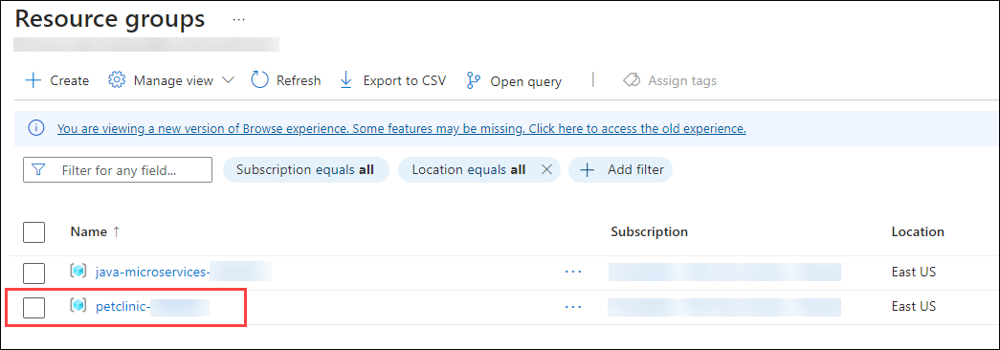

# Exercise 2: Enable monitoring and end-to-end tracing

### Estimated Duration : 60 minutes

## Lab Scenario

You have created your Azure Container Apps environment, deployed your applications to it and exposed them through the api-gateway service. Now that everything is up and running, it would be nice to monitor the availability of your applications and to be able to see if any errors or exceptions occur in your applications. In this lab you will add monitoring and end-to-end tracing to your applications.

## Lab Objectives

After you complete this lab, you will be able to:

 - Inspect your Azure Container Apps in the Azure Portal
 - Configure Azure Container Apps environment monitoring
 - Configure Application Insights to receive monitoring information from your applications
 - Analyze application specific monitoring data

## Task 1: Inspect your Azure Container Apps in the Azure Portal

1. Navigate to the **Azure portal**, and to the resource group where you deployed your Azure Container Apps environment. Select the **customers-service** container app. 

1. In the left menu, under **Application**, select **Revisions and replicas** and check the status of replica. It should be in **Running state**.

   >**Note:** If the replica is not in running state, please access the URL of the container app from overview page. It will activate the replica.

1. Once the replica is in running state, you can see the live console logs by selecting **Log Stream** from left menu.

1. Click on system to see live system logs.

## Task 2: Configure Azure Container Apps environment monitoring

1. Navigate back to the **Visual Studio Code** terminal, in which the **Git Bash** is open.

1. Run the following command, which will create a **Log Analytics Workspace**

   ```
   WORKSPACE=la-petclinic-<inject key="DeploymentID" enableCopy="false" />
   RESOURCE_GROUP=petclinic-<inject key="DeploymentID" enableCopy="false" />

   az monitor log-analytics workspace create \
    --resource-group $RESOURCE_GROUP \
    --workspace-name $WORKSPACE   
   ```

   >**Tip:** A Log Analytics Workspace in Azure is a centralized platform for collecting, analyzing, and querying log and performance data from various resources and services.

1. Enable logging on your Azure Container Apps environment by running the below command block.

   ```
   ACA_ENVIRONMENT=acaenv-petclinic-<inject key="DeploymentID" enableCopy="false" />

   WORKSPACECID=$(az monitor log-analytics workspace show -n $WORKSPACE -g $RESOURCE_GROUP --query customerId -o tsv)

   WORKSPACEKEY=$(az monitor log-analytics workspace get-shared-keys -n $WORKSPACE -g $RESOURCE_GROUP --query primarySharedKey -o tsv)

   az containerapp env update \
        --name $ACA_ENVIRONMENT \
        --resource-group $RESOURCE_GROUP \
        --logs-destination log-analytics \
        --logs-workspace-id $WORKSPACECID \
        --logs-workspace-key $WORKSPACEKEY   
   ```

1. To verify that monitoring data is available in your Log Analytics workspace, in the Azure Portal, navigate back to the **Customer Service** container app page.

1. From the left menu, select **Logs** under monitoring. You can inspect here the monitoring data in your app. 

1. If you double click **ContainerAppConsoleLogs_CL** and press **Run** it will show you the data in this log table.

## Task 3: Configure Application Insights to receive monitoring information from your applications

You now know how to set up monitoring for your overall Azure Container Apps environment. However, you would also like to get monitoring info on how your applications run in the cluster. To track Application specific monitoring data, you can use Application Insights.

1. As a first step, you will need to create an **Application Insights** resource. To do that, navigate back to the **Git Bash** terminal window inside your **Visual Studio Code** and run the following command.

   ```
    WORKSPACEID=$(az monitor log-analytics workspace show -n $WORKSPACE -g $RESOURCE_GROUP --query id -o tsv)
    AINAME=ai-petclinic-<inject key="DeploymentID" enableCopy="false" />
    az extension add -n application-insights
    az monitor app-insights component create \
        --app $AINAME \
        --location $LOCATION \
        --kind web \
        -g $RESOURCE_GROUP \
        --workspace $WORKSPACEID
   ```
   >**Tip:** Azure Application Insights is an extensible service for monitoring live applications, providing real-time insights into performance, usage, and diagnostics.

1. Make note of the Application Insights connection string, you will need this later in this module.
 
   ```
   AI_CONNECTIONSTRING=$(az monitor app-insights component show --app $AINAME -g $RESOURCE_GROUP --query connectionString --output tsv)

   echo $AI_CONNECTIONSTRING
   ```

1. Since you will now be containerizing the different microservices, you will also need to create a new **Azure Container Registry (ACR)** instance for holding your container images.

   ```
   MYACR=acr$APPNAME$UNIQUEID
   az acr create \
    -n $MYACR \
    -g $RESOURCE_GROUP \
    --sku Basic \
    --admin-enabled true
   ```
   
   >**Tip:** Azure Container Registry (ACR) is a fully managed service that allows you to store, build, and manage container images and artifacts in a private registry, seamlessly integrating with your Azure services and CI/CD pipelines.

1. Run the following command to  create an identity which can be used by your container apps to connect to the Container Registry. 

   ```
   ACA_IDENTITY=uid-petclinic-<inject key="DeploymentID" enableCopy="false" />
   az identity create --resource-group $RESOURCE_GROUP --name $ACA_IDENTITY --output json
   USER_ID=$(az identity show --resource-group $RESOURCE_GROUP --name $ACA_IDENTITY --query id --output tsv)
   SP_ID=$(az identity show --resource-group $RESOURCE_GROUP --name $ACA_IDENTITY --query principalId --output tsv)
   echo $USER_ID
   echo $SP_ID
   ```
1. Assign user identity to the container apps environment by running the below command.

   ```
   az containerapp env identity assign -g $RESOURCE_GROUP -n $ACA_ENVIRONMENT --user-assigned $USER_ID
   ```

1. Assign access for the container app identity to pull images from your container registry.

   ```
   ACR_ID=$(az acr show -n $MYACR -g $RESOURCE_GROUP --query id -o tsv)
   az role assignment create --assignee $SP_ID --scope $ACR_ID --role acrpull
   ```

1. As you are in the `src` directory, create a **staging-acr** folder and navigate to it by running this command.

   ```
   mkdir staging-acr
   cd ./staging-acr
   ```

1. In this new folder download the latest application insights agent jar file. Also rename the jar file to **ai.jar**. You can do this by running the following command.

   ```
   AI_VERSION=3.5.4
   wget https://github.com/microsoft/ApplicationInsights-Java/releases/download/$AI_VERSION/applicationinsights-agent-$AI_VERSION.jar
   mv applicationinsights-agent-$AI_VERSION.jar ai.jar
   ```
1. Now select the **staging-acr (1)** directory from explorer. Click on **New File Icon (2)** at the top to create a new file inside staging-acr directory.

   

1. Provide the name of the file as `Dockerfile` and hit enter to open that file.

   >**Note:** Provide the name carefully, as the Dockerfile should not have any file extension and also it is case sensitive.

1. Paste the following data inside the `Dockerfile`. This Dockerfile copies the application jar file and ai.jar file into the container. It also adds the ai.jar file as a javaagent to your app, so it can start logging.

   ```
   # Build stage
   FROM mcr.microsoft.com/openjdk/jdk:17-mariner
   COPY spring-petclinic-my-service-3.0.2.jar app.jar
   COPY ai.jar ai.jar
   EXPOSE 8080
   # Run the jar file
   ENTRYPOINT ["java","-Djava.security.egd=file:/dev/./urandom","-javaagent:/ai.jar","-jar","/app.jar"]
   ```

1. You will now use Azure Container Apps’ ability to deploy from source code with the --source switch. If you execute this statement in the staging-acr directory, it will pick up the files in the directory as well as the Dockerfile and it will containerize the application for you. Do this first for the api-gateway service. Notice how you are also setting the APPLICATIONINSIGHTS_CONNECTION_STRING and APPLICATIONINSIGHTS_CONFIGURATION_CONTENT environment variables.

1. Run the below command block, which deletes the previous container app and creates a new container app from `Dockerfile`.

   ```
   export APP_NAME="api-gateway"
   cp ../spring-petclinic-$APP_NAME/target/spring-petclinic-$APP_NAME-$VERSION.jar spring-petclinic-$APP_NAME-$VERSION.jar
   sed -i "s|my-service|$APP_NAME|g" Dockerfile

   az containerapp delete --name $APP_NAME --resource-group $RESOURCE_GROUP --yes

   az containerapp create \
      --name $APP_NAME \
      --resource-group $RESOURCE_GROUP \
      --source .  \
      --env-vars APPLICATIONINSIGHTS_CONNECTION_STRING=$AI_CONNECTIONSTRING APPLICATIONINSIGHTS_CONFIGURATION_CONTENT='{"role": {"name": "api-gateway"}}' InstrumentationKey=$AI_CONNECTIONSTRING \
      --registry-server $MYACR.azurecr.io \
      --registry-identity $USER_ID \
      --environment $ACA_ENVIRONMENT \
      --user-assigned $USER_ID \
      --ingress external \
      --target-port 8080 \
      --min-replicas 1 

   sed -i "s|$APP_NAME|my-service|g" Dockerfile
   rm spring-petclinic-$APP_NAME-$VERSION.jar
   ```

1. Once the api-gateway deployment has succeeded, execute the same statements for the other microservices.

   * customers-service

   ```
   export APP_NAME="customers-service"
   cp ../spring-petclinic-$APP_NAME/target/spring-petclinic-$APP_NAME-$VERSION.jar spring-petclinic-$APP_NAME-$VERSION.jar
   sed -i "s|my-service|$APP_NAME|g" Dockerfile

   az containerapp delete --name $APP_NAME --resource-group $RESOURCE_GROUP --yes

   az containerapp create \
      --name $APP_NAME \
      --resource-group $RESOURCE_GROUP \
      --source .  \
      --env-vars APPLICATIONINSIGHTS_CONNECTION_STRING=$AI_CONNECTIONSTRING APPLICATIONINSIGHTS_CONFIGURATION_CONTENT='{"role": {"name": "customers-service"}}' InstrumentationKey=$AI_CONNECTIONSTRING \
      --registry-server $MYACR.azurecr.io \
      --registry-identity $USER_ID \
      --environment $ACA_ENVIRONMENT \
      --user-assigned $USER_ID \
      --ingress internal \
      --target-port 8080 \
      --min-replicas 1 

   sed -i "s|$APP_NAME|my-service|g" Dockerfile
   rm spring-petclinic-$APP_NAME-$VERSION.jar
   ```

   * vets-service

   ```
   export APP_NAME="vets-service"
   cp ../spring-petclinic-$APP_NAME/target/spring-petclinic-$APP_NAME-$VERSION.jar spring-petclinic-$APP_NAME-$VERSION.jar
   sed -i "s|my-service|$APP_NAME|g" Dockerfile

   az containerapp delete --name $APP_NAME --resource-group $RESOURCE_GROUP --yes

   az containerapp create \
      --name $APP_NAME \
      --resource-group $RESOURCE_GROUP \
      --source .  \
      --env-vars APPLICATIONINSIGHTS_CONNECTION_STRING=$AI_CONNECTIONSTRING APPLICATIONINSIGHTS_CONFIGURATION_CONTENT='{"role": {"name": "vets-service"}}' InstrumentationKey=$AI_CONNECTIONSTRING \
      --registry-server $MYACR.azurecr.io \
      --registry-identity $USER_ID \
      --environment $ACA_ENVIRONMENT \
      --user-assigned $USER_ID \
      --ingress internal \
      --target-port 8080 \
      --min-replicas 1 

   sed -i "s|$APP_NAME|my-service|g" Dockerfile
   rm spring-petclinic-$APP_NAME-$VERSION.jar
   ```

   * visits-service

   ```
   export APP_NAME="visits-service"
   cp ../spring-petclinic-$APP_NAME/target/spring-petclinic-$APP_NAME-$VERSION.jar spring-petclinic-$APP_NAME-$VERSION.jar
   sed -i "s|my-service|$APP_NAME|g" Dockerfile

   az containerapp delete --name $APP_NAME --resource-group $RESOURCE_GROUP --yes

   az containerapp create \
      --name $APP_NAME \
      --resource-group $RESOURCE_GROUP \
      --source .  \
      --env-vars APPLICATIONINSIGHTS_CONNECTION_STRING=$AI_CONNECTIONSTRING APPLICATIONINSIGHTS_CONFIGURATION_CONTENT='{"role": {"name": "visits-service"}}' InstrumentationKey=$AI_CONNECTIONSTRING \
      --registry-server $MYACR.azurecr.io \
      --registry-identity $USER_ID \
      --environment $ACA_ENVIRONMENT \
      --user-assigned $USER_ID \
      --ingress internal \
      --target-port 8080 \
      --min-replicas 1 
   
   sed -i "s|$APP_NAME|my-service|g" Dockerfile
   rm spring-petclinic-$APP_NAME-$VERSION.jar
   ```

   * admin-server

   ```
   export APP_NAME="admin-server"
   cp ../spring-petclinic-$APP_NAME/target/spring-petclinic-$APP_NAME-$VERSION.jar spring-petclinic-$APP_NAME-$VERSION.jar
   sed -i "s|my-service|$APP_NAME|g" Dockerfile

   az containerapp delete --name $APP_NAME --resource-group $RESOURCE_GROUP --yes

   az containerapp create \
      --name $APP_NAME \
      --resource-group $RESOURCE_GROUP \
      --source .  \
      --env-vars APPLICATIONINSIGHTS_CONNECTION_STRING=$AI_CONNECTIONSTRING APPLICATIONINSIGHTS_CONFIGURATION_CONTENT='{"role": {"name": "admin-server"}}' InstrumentationKey=$AI_CONNECTIONSTRING \
      --registry-server $MYACR.azurecr.io \
      --registry-identity $USER_ID \
      --environment $ACA_ENVIRONMENT \
      --user-assigned $USER_ID \
      --ingress external \
      --target-port 8080 \
      --min-replicas 1

   sed -i "s|$APP_NAME|my-service|g" Dockerfile
   rm spring-petclinic-$APP_NAME-$VERSION.jar 
   ```
 (binding is pending)

 ## Task 4: Analyze application specific monitoring data

 Now that Application Insights is properly configured, you can use this service to monitor what is going on in your application. You can follow the below guidance to do so.

 1. Navigate to the Azure Portal from your browser. Select **petclinic-<inject key="DeploymentID" enableCopy="false" />** resource group from the list.
  
    

1. From the resource list of your resource group, select **Application Insights** resource.

1. On the overview page of **Application Insights**, you can already see data about `Failed requests`, `Server response time`, `server requests` and `Availability`.

1. Select **Application map** from the left menu. This will show you information about the different applications running in your Spring Cloud Service and their dependencies.

1. Select the **api-gateway** service. This will show you details about this application, like slowest requests and failed dependencies.

1. Select **Investigate performance**. This will show you more data on performance.

   >**Tip:** You can also drag your mouse on the graph to select a specific time period, and it will update the view.

1. Select again your Application Insights resource to navigate back to the Application map and the highlighted **api-gateway** service.

1. Select **Live Metrics** from left menu, to see live metrics of your application. This will show you near real time performance of your application, as well as the logs and traces coming in.

(pending)

