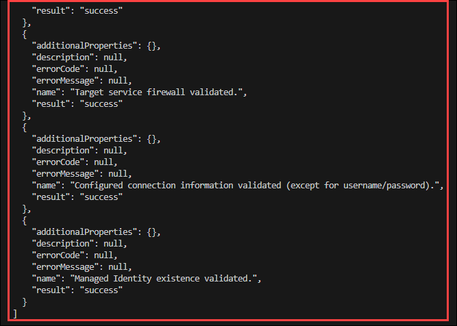

# Exercise 1.3: Connect to Database Securely using Identity

### Estimated Duration: 60 minutes

## Lab Scenario

Your team is now running a first version of the spring-petclinic microservice application in Azure. However you don’t like the fact that your application secrets live directly in configuration code. You would like to have a better way to protect application secrets like your database connection string . In this exercise you will better protect your application secrets.

## Lab Objectives

After you complete this lab, you will be able to:

 - Create a database administrator account
 - Create service connections from the microservices to the database server
 - Update the applications to use passwordless connectivity

## Task 1: Create a database administrator account

In this task, you will perform the steps to create a database administrator account by assigning a user-assigned managed identity to your MySQL server. Additionally, you will configure the current logged-in user as the database administrator using Azure CLI commands.

1. Navigate back to **Git Bash** terminal, run the following command because You will need to allow the user assigned managed identity access to the database. To configure this, you will need to first make your current logged in user account database administrator. For this to work on a MySQL database you first need an additional managed identity.

    ```
     DB_ADMIN_USER_ASSIGNED_IDENTITY_NAME=uid-dbadmin-petclinic-<inject key="DeploymentID" enableCopy="false" />
   
     ADMIN_IDENTITY_RESOURCE_ID=$(az identity create \
      --name $DB_ADMIN_USER_ASSIGNED_IDENTITY_NAME \
      --resource-group $RESOURCE_GROUP \
      --query id \
      --output tsv)
    ```

1. Now you have to assign this identity to your **MySQL Server**.

    ```
      MYSQL_SERVER_NAME=mysql-petclinic-<inject key="DeploymentID" enableCopy="false" />

      az mysql flexible-server identity assign \
         --resource-group $RESOURCE_GROUP \
         --server-name $MYSQL_SERVER_NAME \
         --identity    $DB_ADMIN_USER_ASSIGNED_IDENTITY_NAME

      az mysql flexible-server identity list \
         --resource-group $RESOURCE_GROUP \
         --server-name $MYSQL_SERVER_NAME 
    ```

1. Get the current logged in user and object ID by running this command. This will give you the info of the user account you are currently logged in with in the Azure CLI.

   ```
   CURRENT_USER=$(az account show --query user.name --output tsv)
   echo $CURRENT_USER
   CURRENT_USER_OBJECTID=$(az ad signed-in-user show --query id --output tsv)
   echo $CURRENT_USER_OBJECTID
   ```

1. Next you create a database administrator based on your current user account by running the below command block.

   ```
   DATABASE_NAME=petclinic

   MSYS_NO_PATHCONV=1 az mysql flexible-server ad-admin create \
      --resource-group $RESOURCE_GROUP \
      --server-name $MYSQL_SERVER_NAME \
      --object-id $CURRENT_USER_OBJECTID \
      --display-name $CURRENT_USER \
      --identity $DB_ADMIN_USER_ASSIGNED_IDENTITY_NAME

   DB_ID=$(az mysql flexible-server db show \
       --server-name $MYSQL_SERVER_NAME \
       --resource-group $RESOURCE_GROUP \
       -d $DATABASE_NAME \
       --query id \
       -o tsv)
   ```

## Task 2: Create service connections from the microservices to the database server

In this task, you will configure service connectors for Spring Petclinic microservices (customers, vets, and visits) to connect to the MySQL Flexible server. This will involve creating and validating service connections, setting up environment variables, and enabling passwordless connectivity using managed identity in Azure.

The apps deployed as the Spring Petclinic microservices will now connect using a service connector to the MySQL Flexible server. A service connector will set up the needed environment variables the service needs to make the connection. You can use the following guidance to create a service connector.

1. For creating a service connector you will need to add the serviceconnector-passwordless extension.

   ```
   az extension add --name serviceconnector-passwordless --upgrade
   ```

1. You will need your `subscription ID` and `resources IDs` to create service conections. Run the following commands to get this.

   ```
   SUBID=$(az account show --query id -o tsv)

   CUSTOMERS_ID=$(az containerapp show \
                 --resource-group $RESOURCE_GROUP \
                 --name customers-service \
                 --query id \
                 -o tsv)

    VISITS_ID=$(az containerapp show \
                --resource-group $RESOURCE_GROUP \
                --name visits-service \
                --query id \
                -o tsv)
    
    VETS_ID=$(az containerapp show \
              --resource-group $RESOURCE_GROUP \
              --name vets-service \
              --query id \
              -o tsv)
   ```

1. Create the service connection for the `customers-service`.

   ```
   CLIENT_ID=$(az identity show --resource-group $RESOURCE_GROUP --name $ACA_IDENTITY --query 'clientId' --output tsv)
   echo $CLIENT_ID

   MSYS_NO_PATHCONV=1 az containerapp connection create mysql-flexible \
      --connection mysql_conn \
      --source-id $CUSTOMERS_ID \
      --target-id $DB_ID \
      --client-type SpringBoot \
      --user-identity client-id=$CLIENT_ID  subs-id=$SUBID mysql-identity-id=$ADMIN_IDENTITY_RESOURCE_ID \
      -c customers-service
   ```

1. Now that you have created the service connection, its time to validate the connection.

   ```
   CUSTOMERS_CONN_ID=$(az containerapp connection list \
                --resource-group $RESOURCE_GROUP \
                --name customers-service \
                --query [].id -o tsv)
   
   MSYS_NO_PATHCONV=1 az containerapp connection validate \
       --id $CUSTOMERS_CONN_ID
   ```
   
   

   >**&#128221;Note:** The output of this command should show that the connection was made **successful**.

1. In the same way create the service connections for the `vets-service` and `visits-service`. and validate them.

   * vets-service
   
   ```
   MSYS_NO_PATHCONV=1 az containerapp connection create mysql-flexible \
      --connection mysql_conn \
      --source-id $VETS_ID \
      --target-id $DB_ID \
      --client-type SpringBoot \
      --user-identity client-id=$CLIENT_ID  subs-id=$SUBID mysql-identity-id=$ADMIN_IDENTITY_RESOURCE_ID \
      -c vets-service
   ```
   ```
   VETS_CONN_ID=$(az containerapp connection list \
                --resource-group $RESOURCE_GROUP \
                --name vets-service \
                --query [].id -o tsv)
   
   MSYS_NO_PATHCONV=1 az containerapp connection validate \
       --id $VETS_CONN_ID
   ```
   * visits-service

   ```
   MSYS_NO_PATHCONV=1 az containerapp connection create mysql-flexible \
      --connection mysql_conn \
      --source-id $VISITS_ID \
      --target-id $DB_ID \
      --client-type SpringBoot \
      --user-identity client-id=$CLIENT_ID  subs-id=$SUBID mysql-identity-id=$ADMIN_IDENTITY_RESOURCE_ID \
      -c visits-service
   ```
   ```
   VISITS_CONN_ID=$(az containerapp connection list \
                --resource-group $RESOURCE_GROUP \
                --name visits-service \
                --query [].id -o tsv)
   
   MSYS_NO_PATHCONV=1 az containerapp connection validate \
      --id $VISITS_CONN_ID
   ```

   

   >**&#128221;Note:** The output of this command should show that the connection was made **successful**.

1. In the Azure Portal, navigate to your **customers-service** container app.

   

1. In the customers-service app, select the **Service Connector (1)** from left menu. Notice that you have connection named **DB for MySQL flexible server (2)**.

   

1. Notice that the service connector has all the config values set like `spring.datasource.url`, `spring.datasource.username`, but for instance no `spring.datasource.password`.Instead of spring.datasource.password it has a `spring.cloud.azure.credential.client-id`, which is the client ID of your managed identity. It also defines 2 additional variables `spring.datasource.azure.passwordless-enabled` and `spring.cloud.azure.credential.managed-identity-enabled` for enabling the passwordless connectivity.

   

## Task 3: Update the applications to use passwordless connectivity

1. In the Azure Portal, navigate to your **Container App Environment**, select **Services (1)** from left menu and click on **myconfigserver (2)** java component from the list.

   

1. On **Configure Java component** page, select the previous **Git Configuration (1)** and click on **Delete (2)**.

   

1. After the configuration is deleted, click on **Add** and provide the following details:

   - **Type** : Leave as `Default` **(1)**.
   - **URI** : Provide code repository URI which looks similarto this `https://github.com/<username>/java-microservices-aca-lab.git` **(2)** . Make sure you replace `<username>` with your GitHub Username.
   - **Branch name** : `main` **(3)**.
   - **Search paths** : `config` **(4)**.
   - **Authentication** : Leave as `Public` **(5)**.
   - Click on **Add (6)**.
   
     

1. In **Configure Java component** page, scroll down and click on **Next** 

   

1. Review your configurations and click on configure.

1. Once the configurations are done, navigate to the resource list and select **api-gateway** Container App from the list.

   

1. Copy the **Application URL**, paste it in a new browser tab.

   

1. Now you will see your **Petclinic** application is successfully running on container apps.

   

1. Navigate to **owners** tab and select **All**, you can see the user details which are rendered from the database.

   

   >**&#128221;Note:** Refresh the page, if you are not able to see user data.


## Summary

In this exercise, you created a database administrator account to manage access to the MySQL Flexible server. You established service connections for the Spring Petclinic microservices, allowing them to securely communicate with the database server.

### You have successfully completed this Lab!
   


