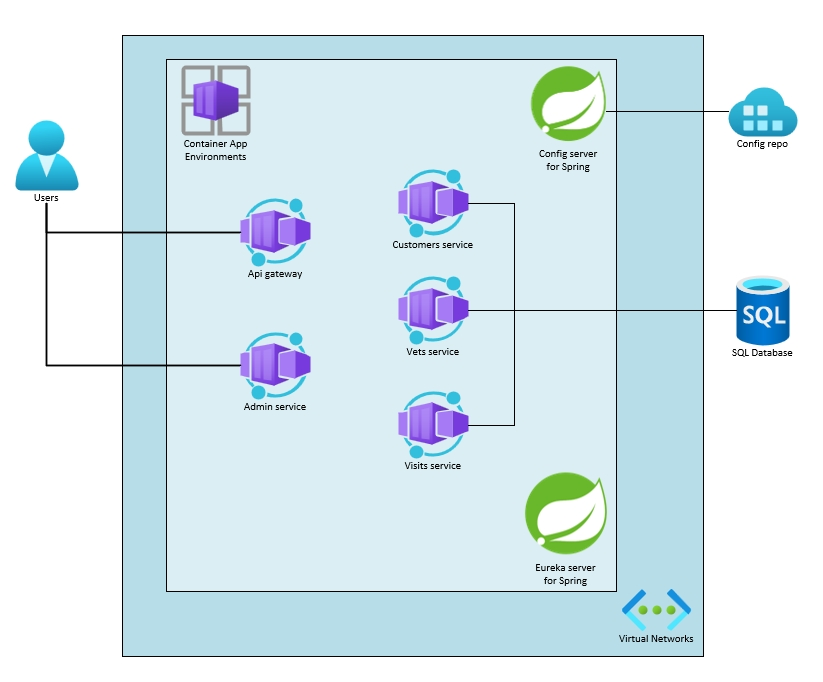
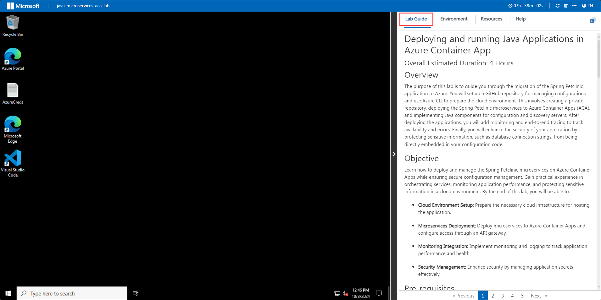
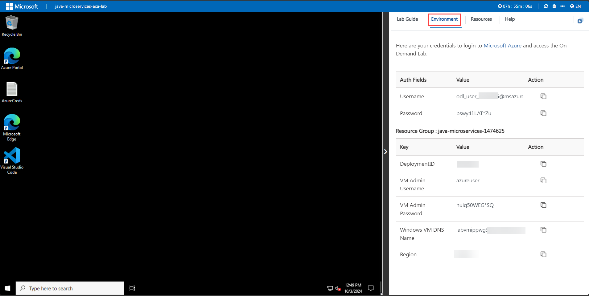
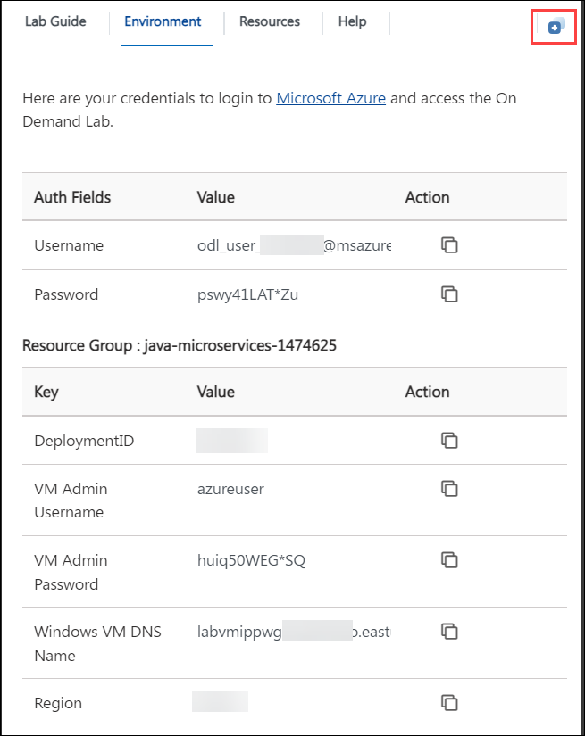
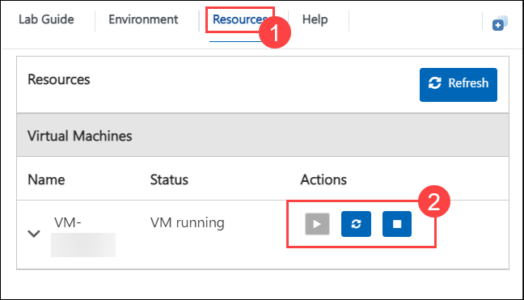
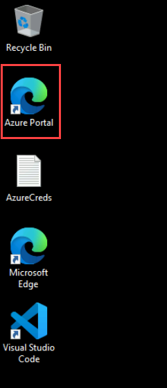
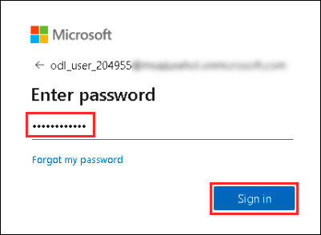
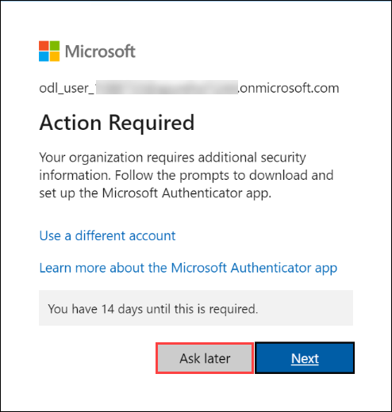

# Deploying and Running Java Application in Azure Container App

### Overall Estimated Duration: 4 Hours

## Overview

The purpose of this lab is to guide you through the migration of the Spring Petclinic application to Azure. You will set up a GitHub repository for managing configurations and use Azure CLI to prepare the cloud environment. This involves creating a private repository, deploying the Spring Petclinic microservices to Azure Container Apps (ACA), and implementing Java components for configuration and discovery servers. After deploying the applications, you will add monitoring and end-to-end tracing to track availability and errors. Finally, you will enhance the security of your application by protecting sensitive information, such as database connection strings, from being directly embedded in your configuration code.

## Objective

Learn how to deploy and manage the Spring Petclinic microservices on Azure Container Apps while ensuring secure configuration management. Gain practical experience in orchestrating services, monitoring application performance, and protecting sensitive information in a cloud environment. By the end of this lab, you will be able to:

 - **Cloud Environment Setup:** Prepare the necessary cloud infrastructure for hosting the application.

 - **Microservices Deployment:** Deploy microservices to Azure Container Apps and configure access through an API gateway.

 - **Monitoring Integration:** Implement monitoring and logging to track application performance and health.

 - **Security Management:** Enhance security by managing application secrets effectively.

## Pre-requisites

 - **Familiarity with Azure:** Basic knowledge of Azure services and the Azure portal for managing cloud resources.

 - **Understanding of Microservices Architecture:** Knowledge of microservices principles, including how microservices communicate and are deployed independently.

 - **Version Control Systems:** Basic understanding of Git and GitHub for managing code repositories and collaboration.

## Architecture

The architecture uses a microservices approach, featuring a Container App Environment to host various microservices such as API Gateway(frontend), Customers, Vets, Admin, and Visits. It incorporates a Config Server for centralized configuration management. Service discovery is facilitated by a Eureka server, ensuring efficient communication between services. Data storage is managed through a SQL database, while Virtual Networks provide network isolation and security, enhancing the overall integrity of the application.

## Architecture Diagram

## Explanation of Components

1. **Container App Environment:** A managed environment for deploying and scaling microservices. It allows for seamless deployment of applications while abstracting infrastructure management.

2. **Config Server:** Centralized management for application configuration, enabling dynamic updates and promoting consistency across microservices without requiring redeployment.

3. **Eureka Server:** Facilitates service discovery by allowing microservices to register themselves and discover other services dynamically, enhancing communication and load balancing.

4. **SQL Database:** Reliable data storage solution for persisting application data. It ensures data integrity and allows for efficient queries and transactions.

5. **Virtual Network:** Provides network isolation and security for the microservices, ensuring that they communicate securely and efficiently within the Azure cloud environment.

6. **Azure Monitor and Application Insights:** Tracks API performance and provides alerts for monitoring and optimization.

## Getting Started with Lab

Welcome to your Java Apps On ACA Lab! We've prepared a seamless environment for you to explore and learn. Let's begin by making the most of this experience.

### Accessing Your Lab Environment

Once you're ready to dive in, your virtual machine and lab guide will be right at your fingertips within your web browser.

### Exploring Your Lab Resources

To get a better understanding of your lab resources and credentials, navigate to the **Environment** tab.

### Utilizing the Split Window Feature

For convenience, you can open the lab guide in a separate window by selecting the Split Window button from the Top right corner.

### Managing Your Virtual Machine

Feel free to start, stop, or restart your virtual machine as needed from the Resources tab. Your experience is in your hands!

## Let's Get Started with Azure Portal

1. In the JumpVM, click on Azure portal shortcut of Microsoft Edge browser which is created on desktop.

   

2. On **Sign into Microsoft Azure** tab you will see login screen, in that enter following email/username and then click on **Next**.

   - Email/Username: <inject key="AzureAdUserEmail"></inject>

   

3. Now enter the following password and click on **Sign in**.

   - Password: <inject key="AzureAdUserPassword"></inject>

   

   >**Note:** If you see the Action Required dialog box, then select Ask Later option.

   

4. If you see the pop-up **Stay Signed in?**, click No.

5. If you see the pop-up **You have free Azure Advisor recommendations!**, close the window to continue the lab.

6. If a **Welcome to Microsoft Azure** popup window appears, click **Cancel** to skip the tour.

7. Now, click on the **Next** from lower right corner to move on next page.

## Support Contact

1. The CloudLabs support team is available 24/7, 365 days a year, via email and live chat to ensure seamless assistance at any time. We offer dedicated support channels tailored specifically for both learners and instructors, ensuring that all your needs are promptly and efficiently addressed.Learner Support Contacts:

   - Email Support: labs-support@spektrasystems.com
   - Live Chat Support: https://cloudlabs.ai/labs-support

2. Now, click on Next from the lower right corner to move on to the next page.

## Happy Learning!!

